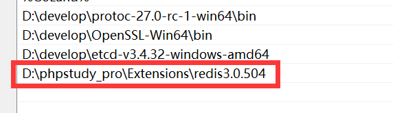
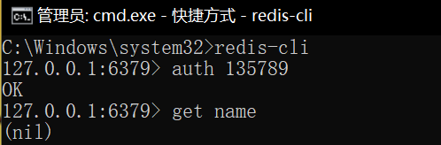

# redis 安装与使用
## windows 安装 redis（非官方渠道）
### 下载 phpstudy
[PHPstudy下载网址](https://www.xp.cn/)
> [!TIP]需要安装在全英文路径下
### 在phpstudy中下载
### 配置环境变量

### 验证安装成功
> 认证方式：  
> redis-cli -a ******  
> 或者  
> redis-cli  
> auth ******  



## docker 安装 redis
> docker run: 这是Docker的命令，用于创建并启动一个新的容器实例。  
> -itd: 这是三个不同的选项的组合。  
> -i 表示交互式操作，即使没有连接到容器的标准输入，容器也会保持运行状态。  
> -t 表示分配一个伪终端（pseudo-TTY），这样可以与容器进行交互。  
> -d 表示后台运行容器，并返回容器ID。  
> --name redis: 这个选项给容器指定一个名称，这里是"redis"。这样你就可以通过这个名称来引用容器，而不是使用容器ID。  
> --restart=always: 这个选项表示如果容器在运行时停止，Docker将自动尝试重启容器。always 表示无论容器退出代码如何，都会尝试重启。  
> -p 6379:6379: 这个选项用于映射端口。这里将容器内部的Redis服务使用的端口6379映射到宿主机的6380端口。这意味着你可以通过宿主机的6379端口来访问容器内的Redis服务。  
> redis:5.0.5: 这是容器镜像的名称和标签。redis 是镜像名称，5.0.5 是标签，表示使用Redis 5.0.5版本的镜像。  
> --requirepass "redis": 这个选项用于设置Redis服务器的密码。这里设置的密码是"135789"，这意味着在连接到Redis服务器时需要提供这个密码。  
```shell
docker pull redis:5.0.5
docker run -itd --name redis --restart=always -p 6380:6379 redis:5.0.5 --requirepass "135789"
```
```shell
# 查看 redis 的日志输出
docker logs redis
```
## 连接 docker 中的 redis
### 命令行连接
```shell
redis-cli -h 127.0.0.1 -p 6380 -a 135789
```
> 如果需要用内网ip连接，需要将redis服务的ip由127.0.0.1改为0.0.0.0
### 代码连接
```shell
go get github.com/go-redis/redis
```
```go
package main

import (
	"fmt"
	"github.com/go-redis/redis"
)

func main() {
	client := redis.NewClient(&redis.Options{
		Addr:     string("127.0.0.1:6379"),
		Password: string("135789"),
		DB:       0,
	})
	tmp := client.Get("name")
	fmt.Println(tmp)
}
```
```go
var DB *redis.Client

func RedisConnect() {
	client := redis.NewClient(&redis.Options{
		Addr:        string("127.0.0.1:6379"),
		Password:    string("135789"),
		DB:          0,
		DialTimeout: time.Second,
	})
	err := client.Ping().Err()
	if err != nil {
		panic("连接失败")
	}
	DB = client
}

func main() {
	RedisConnect()
}
```
# Redis 五大数据类型
## string字符串
> 不区分大小写
### 基本操作
```shell
redis-cli
auth 135789
set name weipulei
get name
exists name # 判断这个key是否存在
exists name1
del name
get name
GETSET name1 lisi # 如果不存在值，返回nil，set是会执行的
GETSET name1 wangwu # 如果存在值，获取原来的值，并设置新的值
```
### 批量操作
```shell
mset age1 12 age2 13
get age1
get age2
```
### 计数操作
```shell
C:\Windows\system32>redis-cli -a 135789
127.0.0.1:6379> get n
(nil)
127.0.0.1:6379> incr n
(integer) 1
127.0.0.1:6379> get n
"1"
127.0.0.1:6379> incr n
(integer) 2
127.0.0.1:6379> get n
"2"
127.0.0.1:6379> decr n
(integer) 1
127.0.0.1:6379> get n
"1"
127.0.0.1:6379> decr n
(integer) 0
127.0.0.1:6379> decr n
(integer) -1
127.0.0.1:6379> decr n
(integer) -2
127.0.0.1:6379> get n
"-2"
```
自增n，自减m
```shell
127.0.0.1:6379> set n 0
OK
127.0.0.1:6379> incrby n 12
(integer) 12
127.0.0.1:6379> decrby n 3
(integer) 9
```
### 过期操作
> setex 单位是秒
```shell
127.0.0.1:6379> setex name 20 weipulei
OK
127.0.0.1:6379> get name
"weipulei"
127.0.0.1:6379> get name
"weipulei"
127.0.0.1:6379> get name
(nil)
```
查看多久过期
```shell
127.0.0.1:6379> ttl name
(integer) 16
127.0.0.1:6379> ttl name
(integer) 9
127.0.0.1:6379> ttl name
(integer) -2 # 已经过期
127.0.0.1:6379> ttl name
(integer) -2 # 已经过期

127.0.0.1:6379> set name zhangsan
OK
127.0.0.1:6379> ttl name
(integer) -1 # -1表示永不过期

127.0.0.1:6379> expire name 10 # 设置键的过期时间
(integer) 1
127.0.0.1:6379> ttl name
(integer) 3
127.0.0.1:6379> ttl name
(integer) 1
127.0.0.1:6379> ttl name
(integer) -2
```
### 设置中文输出
```shell
127.0.0.1:6379> set name ￂ￪ￆ￦ﾶ￤
OK
127.0.0.1:6379> get name
"\xc2\xea\xc6\xe6\xb6\xe4"

C:\Windows\system32>redis-cli --raw -a 135789
127.0.0.1:6379> set name ￂ￪ￆ￦ﾶ￤
OK
127.0.0.1:6379> get name
玛奇朵
```
## list列表(类似双端队列)
```shell
#  0  1  2  3
# -4 -3 -2 -1
# 10 20 80 90
127.0.0.1:6379> rpush list 80 90
(integer) 2
127.0.0.1:6379> lpush list 20 10
(integer) 4
127.0.0.1:6379> lrange list 0 -1
1) "10"
2) "20"
3) "80"
4) "90"
```
```shell
#  0  1
# -2 -1
# 20 80
127.0.0.1:6379> rpop list
"90"
127.0.0.1:6379> lpop list
"10"
127.0.0.1:6379> lrange list 0 -1
1) "20"
2) "80"
127.0.0.1:6379> llen list
(integer) 2
```
> 应用  
> 任务队列  
> 排行榜  
> 分页查询（有序集合zset） 
## set集合
集合中的元素没有顺序，无重复值

```shell
127.0.0.1:6379> sadd set a b c d # 添加元素
(integer) 4
127.0.0.1:6379> smembers set # 获取所有值
1) "c"
2) "d"
3) "b"
4) "a"
127.0.0.1:6379> sadd set a e # a重复了，没有被添加进来
(integer) 1
127.0.0.1:6379> sadd set a e
(integer) 0
127.0.0.1:6379> scard set # 获取元素个数（set cardinality基数）
(integer) 5
127.0.0.1:6379> smembers set
1) "c"
2) "b"
3) "d"
4) "a"
5) "e"
127.0.0.1:6379> srem set a b c d # 删除元素（set remove）
(integer) 4
127.0.0.1:6379> smembers set
1) "e"
```
差集、并集、交集
> sdiff
> sinter
> sunion
```shell
127.0.0.1:6379> sadd s2 3 4 5
(integer) 3
127.0.0.1:6379> sdiff s1 s2 # 注意：差集是有顺序的
1) "1"
2) "2"
127.0.0.1:6379> sdiff s2 s1
1) "4"
2) "5"
127.0.0.1:6379> sinter s1 s2 # 交集
1) "3"
127.0.0.1:6379> sunion s1 s2 # 并集
1) "1"
2) "2"
3) "3"
4) "4"
5) "5"
```
随机抽奖
```shell
127.0.0.1:6379> sadd order 1 2 3 4 5 6
(integer) 6
127.0.0.1:6379> spop order
"5"
127.0.0.1:6379> sadd order1 1 2 3 4 5 6
(integer) 6
127.0.0.1:6379> spop order1
"4"
127.0.0.1:6379> spop order 2
(error) ERR wrong number of arguments for 'spop' command
# 多个 3.2 版本有效 redis-server -v 查看版本
```
> 使用场景 共同好友 统计网站的独立ip 标签 todo


## hash哈希
```shell
127.0.0.1:6379> hset dict name weipulei # hset key（键名） filed（字段名） value（对应值）
(integer) 1
127.0.0.1:6379> hget dict name # 获取键值中字段对应的value
"weipulei"
127.0.0.1:6379> hset dict age 18
(integer) 1
127.0.0.1:6379> hgetall dict
1) "name"
2) "weipulei"
3) "age"
4) "18"
127.0.0.1:6379> hexists dict age # 键值是否存在
(integer) 1
127.0.0.1:6379> hexists dict age1
(integer) 0
127.0.0.1:6379> hkeys dict # 查看所有key
1) "name"
2) "age"
127.0.0.1:6379> hlen dict # 查看键值个数
(integer) 2
```
设置过期
> 只能设置key值 filed不能设置过期时间
```shell
127.0.0.1:6379> expire dict 20
(integer) 1
127.0.0.1:6379> hget dict name
"weipulei"
127.0.0.1:6379> hget dict name
(nil)
```
> 应用场景 存储配置信息
## zset有序集合
> 数字可以是浮点数
```shell
127.0.0.1:6379> zadd squad 98 shandian 99 maqiduo 90 weipulei 66 daiyan
(integer) 4
127.0.0.1:6379> zrange squad 0 -1 # 通过索引，按照分数从低到高返回
1) "daiyan"
2) "weipulei"
3) "shandian"
4) "maqiduo"
127.0.0.1:6379> zrevrange squad 0 -1 # reverse range
1) "maqiduo"
2) "shandian"
3) "weipulei"
4) "daiyan"
127.0.0.1:6379> zrank squad shandian # 第三个
(integer) 2
127.0.0.1:6379> zrank squad daiyan # 第一个
(integer) 0
127.0.0.1:6379> zrevrank squad daiyan # reverse rank 
(integer) 3
127.0.0.1:6379> zrangebyscore squad 50 90 # 计算指定区间的成员
1) "daiyan"
2) "weipulei"
127.0.0.1:6379> zrevrangebyscore squad 50 90
(empty list or set)
127.0.0.1:6379> zrevrangebyscore squad 90 50 # 从大到小区间内的成员
1) "weipulei"
2) "daiyan"
127.0.0.1:6379> zrange squad 0 -1 withscores # 把成员和分数一起显示出来
1) "daiyan"
2) "66"
3) "weipulei"
4) "90"
5) "shandian"
6) "98"
7) "maqiduo"
8) "99"
127.0.0.1:6379> zrevrange squad 0 -1 withscores
1) "maqiduo"
2) "99"
3) "shandian"
4) "98"
5) "weipulei"
6) "90"
7) "daiyan"
8) "66"
127.0.0.1:6379> zrem squad daiyan # 删除一个成员
(integer) 1
127.0.0.1:6379> zrange squad 0 -1
1) "weipulei"
2) "shandian"
3) "maqiduo"
127.0.0.1:6379> zremrangebyscore squad 95 100 #删除分数在95到100的所有成员
(integer) 2
127.0.0.1:6379> zrange squad 0 -1
1) "weipulei"
127.0.0.1:6379> zincrby squad 2 weipulei # 分数+2
"92"
127.0.0.1:6379> zincrby squad -1 weipulei # 分数-1
"91"
127.0.0.1:6379> zscore squad weipulei
"91"
```
> 使用场景 排行榜 订单支付超时 todo


